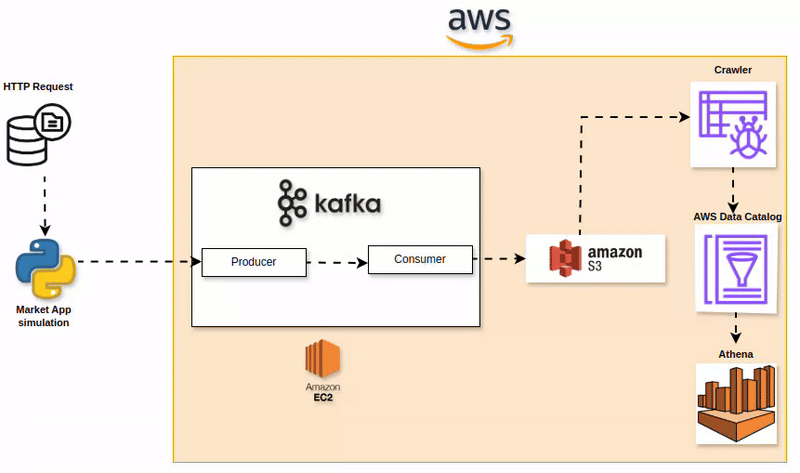

# Kafka-Market-Stream

# Stock Market Kafka Real Time Data Engineering Project

## Introduction 
In this project, you will execute an End-To-End Data Engineering Project on Real-Time Stock Market Data using Kafka.

We are going to use different technologies such as Python, Amazon Web Services (AWS), Apache Kafka, Glue, Athena, and SQL.

## Architecture 


## Technology Used
- Programming Language - Python
- Amazon Web Service (AWS)
1. S3 (Simple Storage Service)
2. Athena
3. Glue Crawler
4. Glue Catalog
5. EC2
- Apache Kafka


## Dataset Used
You can use any dataset, we are mainly interested in operation side of Data Engineering (building data pipeline) 

## Kafka Installation on AWS EC2

This guide provides step-by-step instructions to install and configure Apache Kafka on an AWS EC2 instance.

### Prerequisites
- AWS EC2 instance (Amazon Linux 2 recommended)
- SSH access to the instance
- Basic knowledge of Linux commands

## Installation Steps

### 1. Connect to your EC2 instance
```bash
ssh -i "your-key-pair.pem" ec2-user@your-ec2-public-dns

Here is the dataset used in the video - https://github.com/darshilparmar/stock-market-kafka-data-engineering-project/blob/main/indexProcessed.csv


## Complete Video Tutorial
```

### 2. Install Java (Amazon Corretto 17)
First check if Java is already installed:

```bash
java -version
```
If not installed, install Amazon Corretto 17:

```
bash
sudo dnf install java-17-amazon-corretto
```

Verify the installation:

```bash
java -version
3. Download and extract Kafka
```

bash
wget https://downloads.apache.org/kafka/3.9.0/kafka_2.12-3.9.0.tgz
tar -xvf kafka_2.12-3.9.0.tgz
cd kafka_2.12-3.9.0
4. Configure Kafka
Edit the server properties to use your public IP:

bash
sudo nano config/server.properties
Find and modify the following line:

advertised.listeners=PLAINTEXT://<YOUR_EC2_PUBLIC_IP>:9092
(Replace <YOUR_EC2_PUBLIC_IP> with your actual EC2 public IP address)

5. Start ZooKeeper
In your first terminal session:

bash
bin/zookeeper-server-start.sh config/zookeeper.properties
6. Start Kafka Server
Open a new terminal session (after SSHing again) and run:

bash
export KAFKA_HEAP_OPTS="-Xmx256M -Xms128M"
bin/kafka-server-start.sh config/server.properties
7. Create a Topic
In a new terminal session:

bash
bin/kafka-topics.sh --create --topic demo_01 --bootstrap-server <PUBLIC_IP>:9092 --replication-factor 1 --partitions 1
8. Start Producer
bash
bin/kafka-console-producer.sh --topic demo_01 --bootstrap-server <PUBLIC_IP>:9092
9. Start Consumer
In a new terminal session:

bash
bin/kafka-console-consumer.sh --topic demo_01 --bootstrap-server <PUBLIC_IP>:9092

Video Link - https://www.youtube.com/embed/KerNf0NANMo
